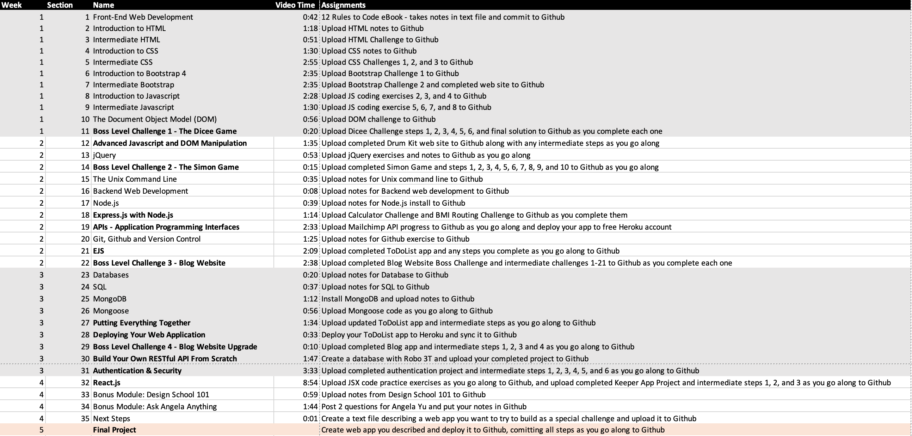

# About this repository

## Contents

This repository tracks my progress in March 2020 through the beginning of June 2020 completing
instructional videos and programming challenges for *The Complete 2020 Web Development Bootcamp* available
on Udemy.com.

https://www.udemy.com/course/the-complete-web-development-bootcamp/

Each week, I watched the videos in the course (usually at 2x speed while running on a treadmill at my 
local gym), then later completed the programming exercises in each section.  About halfway
through the course, I started the actual programming.

You'll see the commit logs tracking my progress.  The *sections* directory contains brief notes
I took as I watched the videos.  The *projects* directory containst the actual programming
exercises.  In some cases, the exercises were completed using cloud-based tools like CodePen or
CodeSandbox.  Wherever possible I exported those code exercises to my repository to show my work.

## About my progress

At the beginning of the course, I had many years of experience in HTML, CSS, and JavaScript 
programming.  I am deeply familiar with many server-side programming languages such as Ruby,
PHP, and to a lesser extent Python.  However, ES6, CSS3 and modern front-end frameworks such
as Bootstrap were very new. 

It turns out, my original schedule to complete the course in 5 weeks was too aggressive.  Watching
videos nearly every day, but doing the programming only 2-3 hours per week, the course took about
3 months to complete.  This schedule was created for myself (with many years of programming
experience) and my nephew (who had only limited HTML and CSS experience prior to starting the
course).

I had no previous experience to any kind of server-side JavaScript development like NodeJS
or Express.  I found that I much prefer development in these environments compared to frameworks
like Ruby on Rails where there's a little too much "magic" behind the scenes being done by generators
and perhaps too much "convention over configuration".  I like the balance that codes with NodeJS
where you can easily see your routes and template files.

Of course NodeJS and express owe a lot to Ruby on Rails, and I brought forth some of my knowledge
there early into this course.  You'll note that I built a singleton library to handle most of the 
MongoDB which forced me to better understand the asynchronous nature of using callbacks in my
NodeJS code.  This slowed my progress but I feel like I achieved more.

## Course information on Udemy

Angela Yu and her group at the London App Brewery did a fantastic job building this course.  This
Web Development 2020 Boot Camp is only one of many courses from Angela I have watched over the last
couple of years.

I strongly recommend you check out all of her courses, from iOS and Swift mobile app development to
her newer courses in Data Science.  She has developed a format for beginners that is very engaging,
encouraging, and progressive.  

https://www.udemy.com/course/ios-13-app-development-bootcamp/

https://www.udemy.com/course/flutter-bootcamp-with-dart/

## Capstone

My final project, not officially a part of the course, is an effort to combine the Secrets project,
which uses NodeJS, Express, and MongoDB as a backend, and Keeper which uses ReactJS as a front-end.

I've successfully deployed both apps separately to Heroku using a MongoDB Atlas backend for access
on the cloud.  I also used the **dotenv** package to make it easy to run both apps locally on my
development laptops (which includes both a 2010 model unibody MacBook running macOS High Sierra as
well as a more modern and powerful MacBook Pro running macOS Catalina).

It's not clear if I'll actually complete this capstone; exploring several blog posts on the subject
there are a few additional frameworks I should learn that would make this a lot easier. 

I've just started London App Brewery's *Complete 2020 Data Science and Machine Learning Bootcamp*, so
this capstone project may end up taking the back burner for a few months.

https://www.udemy.com/course/python-data-science-machine-learning-bootcamp/
